# Proyecto 9: Página web "Alrededor de Chile"

La página web "Alrededor de Chile" es el proyecto del curso de Desarrollo Web de Tripleten que abarca desde el Sprint 5 hasta el término curso. Es una sitio que muestra imágenes del país, dando la opción de modificar el perfil, añadir nuevas fotos a la galería o eliminarlas.
En esta fase, el enfoque está puesto en Javascript y la refactorización del código creado en el sprint 5, con enfoque en programación orientada a objetos.

# URL de la página: https://fabi-parra.github.io/web_project_around/

## Las principales secciones de la página son:

1. Encabezado: cuenta con un logo.
2. Perfil: sección que muestra una fotografía del usuario, su nombre y su ocupación. Posee 2 botones importantes que permiten modificar elementos: uno situado al lado del nombre, que permite abrir el popup para modificar la información de usuario y otro sobre el avatar de usuario, que abre el popup para modificar esta imagen de perfil.
3. Ventanas emergentes: 3 botones permiten la apertura de 3 ventanas emergentes con formularios, uno para modificar el perfil de usuario, otro para cambiar el avatar y un último para añadir nuevas tarjetas. Los botones para el envío de estos formularios permanecen inactivos mientras no se completen los campos de la forma que la validación requiere. Hay un cuarto popup que se abre dando clic a la fotografía de cada tarjeta, y muestra dicha imagen más su nombre en la parte inferior.
4. Tarjetas de imágenes: colección de tarjetas, creadas a través de instancias de la clase Card, dispuestas en un grid. Las tarjetas se componen de una fotografía, título y 2 botones, uno que permite dar "me gusta" y otro que permite eliminar la tarjeta.

### Características del proyecto

Para la creación de esta página se aplicaron los conocimientos obtenidos hasta ahora en el curso, con énfasis en el trabajo con APIs, Javascript, validación de formularios y programación orientada a objetos. A continuación se realiza una descripción:

- Conexión de la página web a un servidor.
- Incorporación del trabajo con APIs. Para este proyecto, tanto la información de perfil como las tarjetas se obtienen desde un servidor.
- Refactorización del código para la realización de solicitudes al servidor. Las acciones realizadas en la página web, como modificar el avatar, editar el perfil,añadir cartas y sus acciones (me gusta y eliminar) se procesan a través de solitudes FETCH en una nueva clase llamada API.
- Cada método que permite hacer solicitudes al servidor devuelve un objeto Promise.
- Procesamiento los errores dentro de catch(). Si la solicitud no puede llegar al servidor o el servidor no responde, se ejecuta el bloque catch().
- No hay instancias de otras clases dentro de la clase Api . Dentro de Api no
  se llama a métodos de otras clases. Se usa el acoplamiento flexible o débil
  entre clases.
- Mejoramiento de la experiencia de usuario. Al editar un perfil, se notificará al usuario que el proceso de carga está en marcha, cambiando el texto del botón por "Guardando...".
- Creación de ventanas emergentes con HTML y CSS.
- Aplicación de conocimientos de Javascript para la interactividad de los cuadros emergentes. Los popup boxes pueden cerrarse en todas las resoluciones de pantalla, dando clic en el icono, apretando la tecla escape o haciendo clic fuera de la ventana emergente. Los popups no se cierran al hacer clic dentro de sus bordes (en el
  propio formulario, no en la ventana).
- Javascript, HTML y CSS para la validación de los 3 formularios.
- Uso de estructura de archivos plana de BEM: los archivos de estilos se organizan en bloques de acuerdo con la metodología BEM. Cada bloque cuenta con sus estilos y se importan a un único archivo, index.css, mediante el método @import. Se vincula este archivo CSS raíz al archivo HTML.
- Instalación de fuentes directamente en el proyecto, mediante @font-face.
- HTML SEMÁNTICO: uso de etiquetas semánticas para definir la estructura de las principales secciones de la página (header, main y footer), así como para artículos, enlaces, imágenes y elementos de texto.
- CSS.
- Grid layout.
- Uso de media queries.
- Flexbox básico y avanzado.

#### Video demostrativo del proyecto

[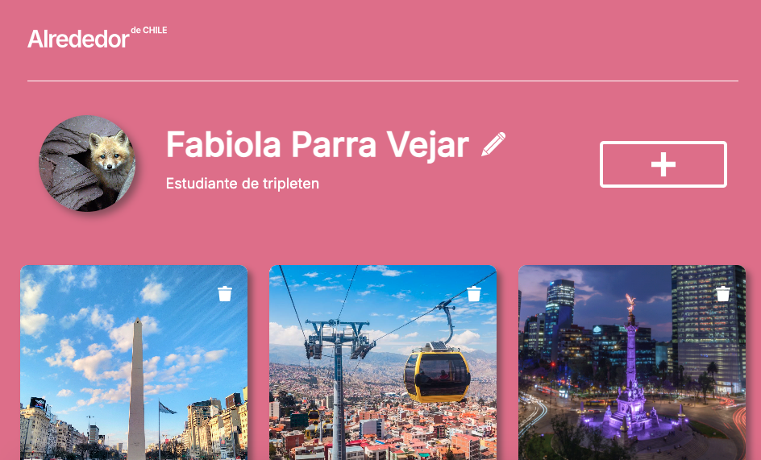](https://youtu.be/ueAWIsuUogM)

##### Gifs del proyecto

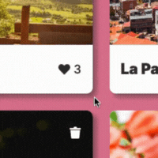
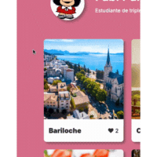
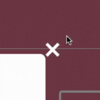
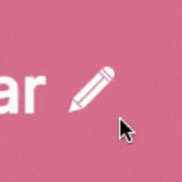
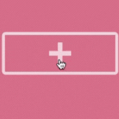
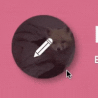

###### Capturas de pantalla del proyecto

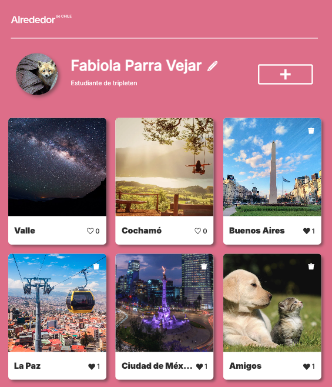
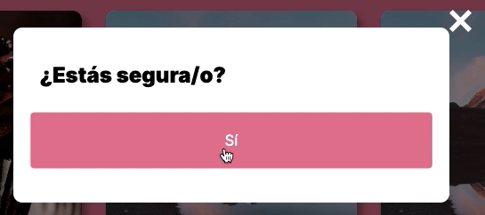
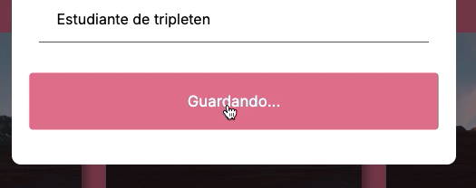
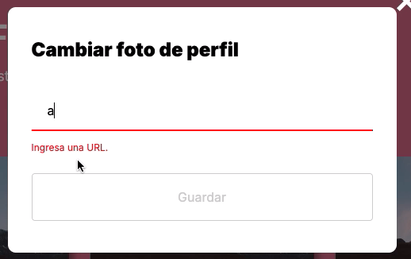
